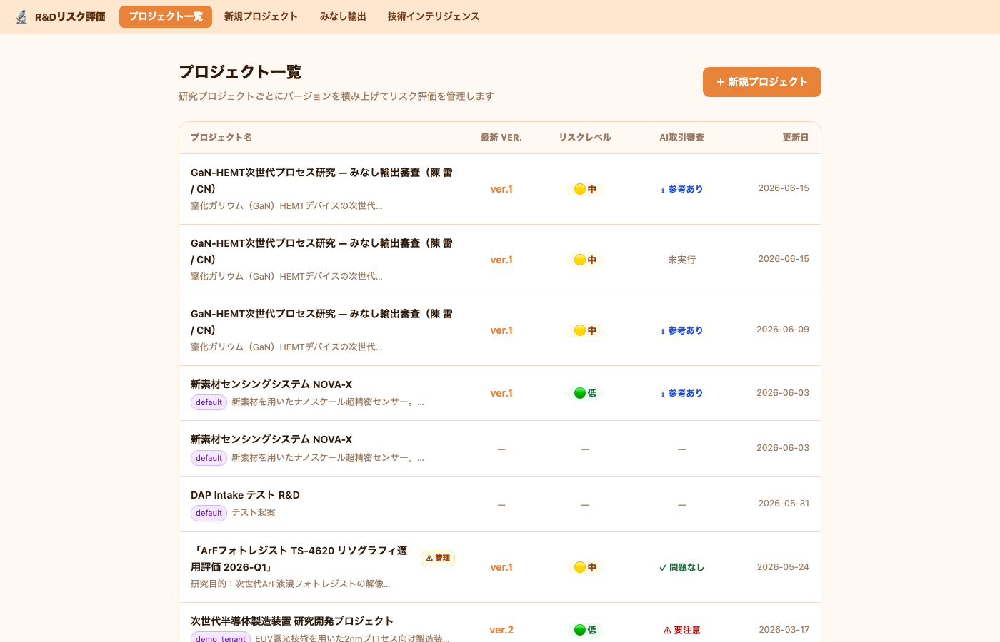
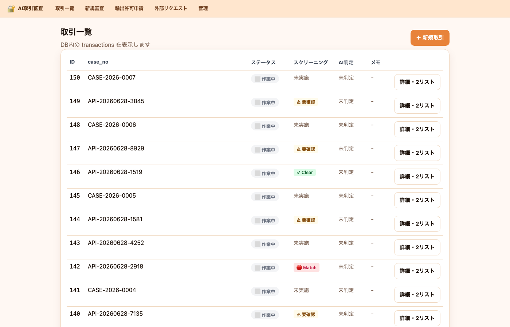
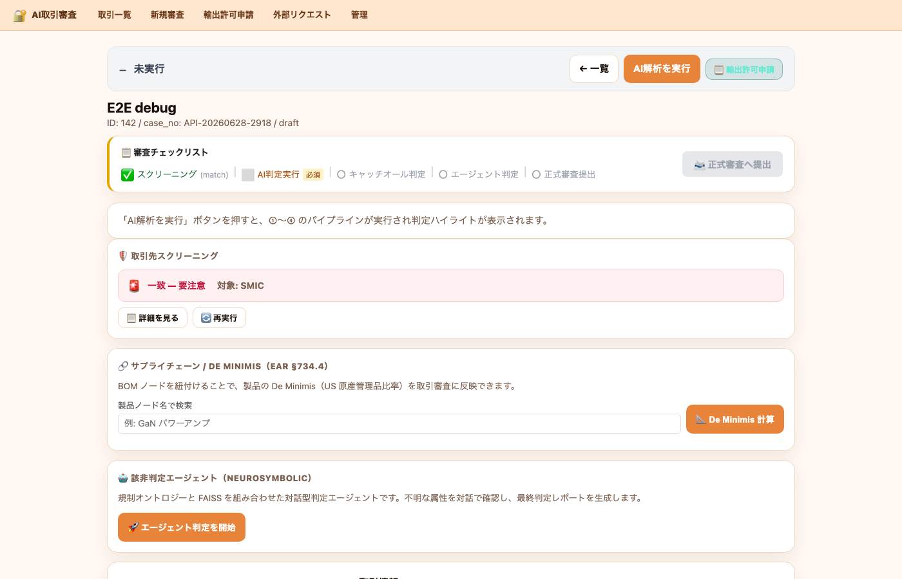
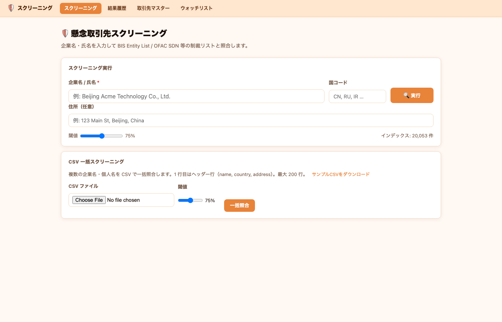
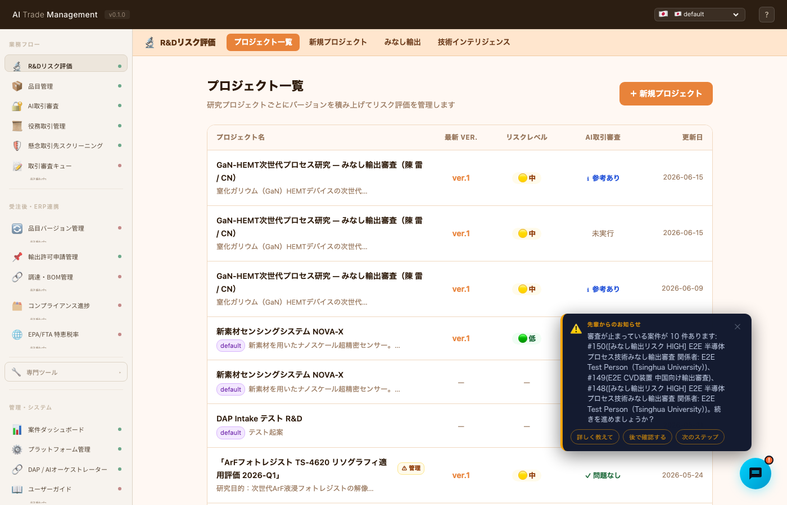
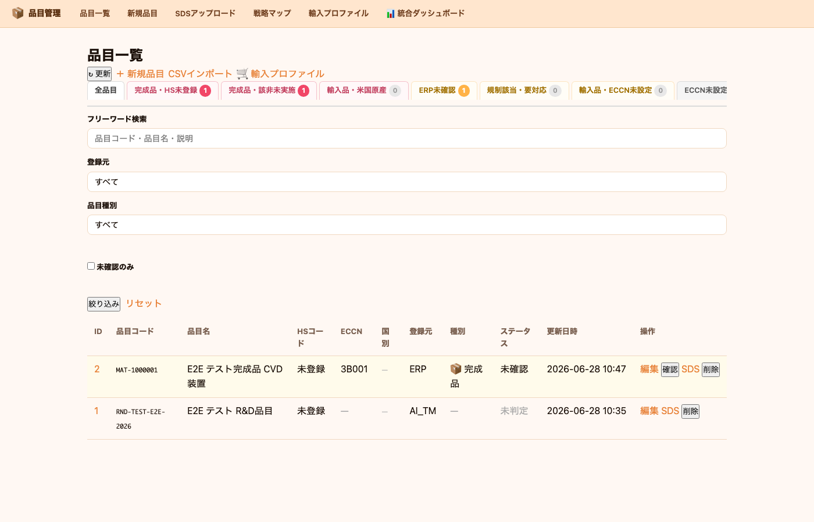
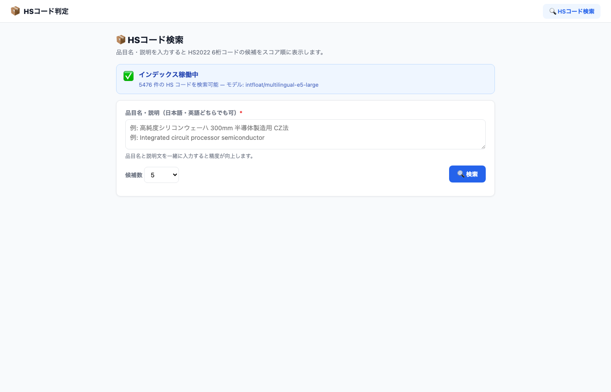
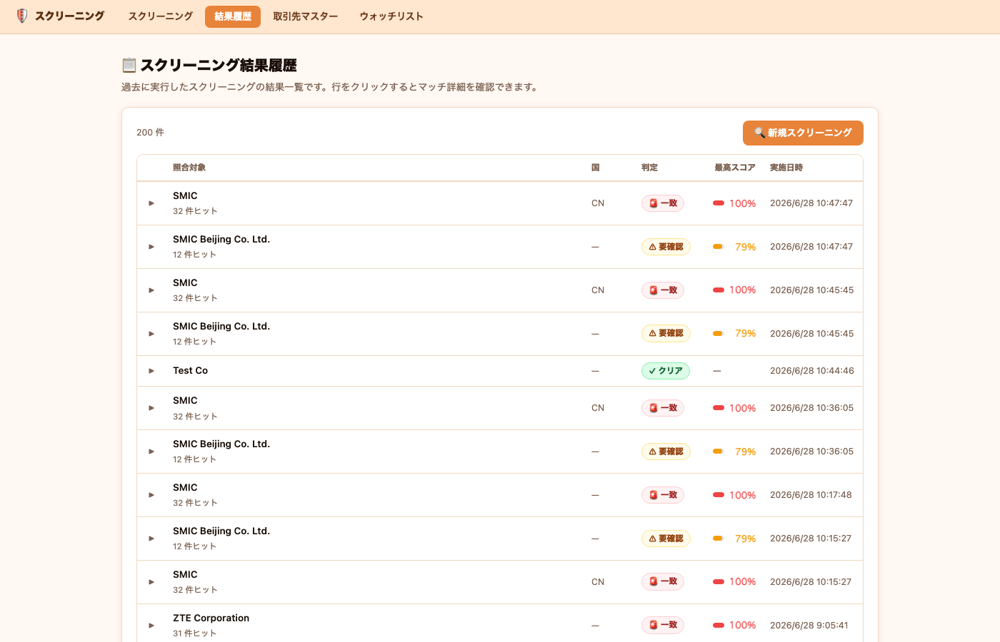
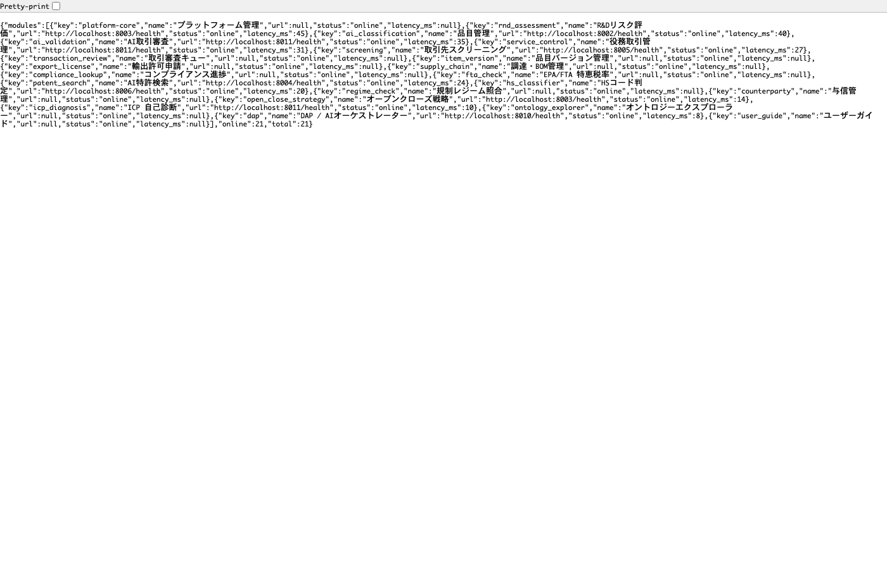

# AI Trade Management  
## 製品概要・業務フロー説明書

**バージョン 1.0 — 2026年6月**  
対象: 製造業・商社 コンプライアンス／輸出管理担当者・経営層

---

## エグゼクティブサマリー

**AI Trade Management（AI TM）** は、R&D 起案から ERP 出荷承認まで、輸出管理コンプライアンスの全工程を一本のデジタルレーンとして統合する AI プラットフォームです。

日本の外為法・米国 EAR/ECCN・Wassenaar Arrangement に対応し、**スクリーニング→該非判定→ライセンス管理→ERP 出荷ステータス反映** を自動連携します。従来は担当者が Excel・メール・基幹システムを個別に操作していた工程を、単一プラットフォームで完結させます。

| 指標 | 目標値 |
|------|--------|
| 該非判定工数削減 | 70〜80% |
| スクリーニング漏れリスク | ほぼゼロ（常時監視） |
| ERP 出荷ブロック解除リードタイム | 手動数日 → 自動数時間 |
| 対応規制 | 外為法 / EAR-ECCN / Wassenaar / OFAC / BIS Entity List |

---

## 1. プロダクトコンセプト

### 1-1. 解決する課題

製造業・商社の輸出管理部門が直面する本質的な問題は、**業務が「点」で存在し「線」でつながっていない**ことです。

```
現状（サイロ型）
┌──────────┐  手動転記  ┌──────────┐  メール  ┌──────────┐
│  R&D 起案  │ ─────────▶│ 品目管理  │ ────────▶│ ERP 出荷  │
└──────────┘           └──────────┘          └──────────┘
     │                      │                      │
  独自DB                  Excel                  基幹DB
     ↓ 別担当に依頼           ↓ 別ツールで照合          ↓ 手動ステータス更新
   スクリーニング          該非判定            ライセンス確認
```

**結果として起きること**
- R&D 案件が品目登録や該非判定につながるまで数日〜数週間のラグが発生
- スクリーニングは出荷直前にしか実施されず、制裁当事者への出荷直前ブロックが発生
- ERP の出荷ステータスとコンプライアンス状態が乖離したまま運用
- BOM の調達先変更が輸出管理側に届かず、COO（原産地）判定が陳腐化

### 1-2. AI TM が実現するコンセプト

```
AI Trade Management（統合型）

  R&D 起案 ──▶ 品目自動登録 ──▶ 取引審査 ──▶ スクリーニング
      │               │               │               │
      └───────────────┴───────────────┴───────────────┘
                              │
                    AI 判定エンジン（FAISS + 知識グラフ + Agent）
                              │
              ┌───────────────┴───────────────┐
              ▼                               ▼
        輸出許可申請                    ERP リアルタイム通知
        ライフサイクル管理                出荷 GO / NEEDS_REVIEW / BLOCK
```

**ERP をマスタ、AI TM をコンプライアンスエンジンとして共存する「パラレルレーン」設計**が本プロダクトの核心です。ERP は取引・物流の起点を管理し、AI TM はそれに対するリスク判定・コンプライアンス承認を担い、双方がリアルタイムに状態を同期します。

---

## 2. 7 つのコア業務フロー

### フロー全体像

```
② R&D 品目                 ④ ERP 品目バッチ
   自動登録                    連携（erp-sync）
      │                              │
      ▼                              ▼
①  R&D 起案  ──────────────▶  AI TM 品目マスタ
      │                              │
      │ ③ R&D 出荷/                  │ ⑤ ERP SO 連携
      │   サンプル出荷               ▼
      └────────────────────▶  取引審査（Transaction）
                                      │
                          ┌──────────┴──────────┐
                          ▼                       ▼
                    ⑤ スクリーニング        ⑤ 2リスト / AI 判定
                          │                       │
                ⑥ match  │                       │ 判定完了
                 ──────────▶ ERP NEEDS_REVIEW      ▼
                                         ERP APPROVED / 輸出許可申請
                                                  ③
              ⑦ BOM COO 変更                       │
               ──────────▶ item_version alert      │
               解除後      ──────────▶ ERP APPROVED ┘
```

---

### ① R&D リスク評価・案件起案

**担当**: 研究開発部門 / 輸出管理部門  
**使用モジュール**: `rnd_assessment`（ポート 8003）

研究開発の初期段階から輸出管理リスクを評価し、みなし輸出リスク・技術の機密性を数値化します。

**主要機能**
- プロジェクトごとにバージョン管理（ver.1, ver.2…）
- リスクスコア自動算出（技術機密性・関係者属性・仕向地リスク）
- みなし輸出（Deemed Export）判定：外国人研究者への技術提供を自動フラグ
- HIGH/CRITICAL リスクの案件は `ai_validation` に自動連携し取引審査案件を生成


*▲ R&D プロジェクト一覧。リスクレベル（高/中/低）・AI 取引審査参照の有無がひと目でわかる*

---

### ② R&D → 品目自動登録

**担当**: 自動連携（バックグラウンド処理）  
**フロー**: `rnd_assessment` → `ai_classification`

R&D アセスメント実行時、品目情報を `ai_classification` に自動登録します。担当者が再入力する必要はなく、R&D 起案時点から品目マスタにエントリーが作られます。

```
rnd_assessment: assessments_run POST
        ↓
ai_classification: POST /api/products
        ↓
code = "RND-{case_id}" で品目エントリー自動生成
（ECCN 未判定状態で登録、以後の審査プロセスで充填）
```

---

### ③ R&D 出荷・サンプル出荷 → 取引審査

**担当**: 輸出管理部門  
**使用モジュール**: `rnd_assessment` → `ai_validation`

試作品・サンプルの海外提供は、通常の製品出荷と同等の輸出管理が必要です。R&D 案件から直接、AI TM の取引審査（Transaction）を起票できます。

**みなし輸出リスクイベント（DEEMED_EXPORT_RISK）**
```
rnd_assessment が HIGH リスク判定
        ↓
ai_validation: POST /api/transactions/events
  event_type: "DEEMED_EXPORT_RISK"
  person_name: "Tsinghua University 研究者"
  deemed_export_risk_level: "HIGH"
        ↓
取引審査案件を自動生成（case_ref: CASE-2026-XXXX）
審査担当者に通知
```

---

### ④ ERP 品目バッチ連携（erp-sync）

**担当**: ERP システム（自動）/ 情報システム部門  
**使用モジュール**: `ai_classification` → `platform_core`

ERP で製品化された品目（完成品・購入部品）を AI TM へバッチ連携します。BOM 情報を含む構造化データを受け取り、品目マスタを自動更新します。

**連携データ**

| フィールド | 内容 |
|-----------|------|
| `code` | 品目コード（ERP マスタ品番） |
| `eccn` | ECCN コード |
| `country_of_origin` | 原産国 |
| `bom[]` | BOM 構成部品・各部品の原産国 |
| `item_type` | 完成品 / 原材料 / 購入部品 等 |

**BOM COO 変更の自動検知**  
前回連携からの差分を比較し、原産地（COO）に変化があった場合は `coo_change` イベントを自動生成します（→ フロー⑦へ）。

---

### ⑤ ERP SO → AI TM 取引審査・スクリーニング → ERP ステータス返却

**担当**: 輸出管理部門（AI サポート）  
**使用モジュール**: `ai_validation`、`screening`、`platform_core`

ERP で受注（Sales Order）が発生すると、AI TM に取引審査案件が作成されます。審査は以下のパイプラインで自動進行します。

```
ERP SO 発生
    ↓
ai_validation: POST /api/transactions
（品目コード・取引先・仕向地・用途を登録）
    ↓
┌─────────────────────────────────────────────┐
│            AI 審査パイプライン               │
│                                             │
│  Step 1: 取引先スクリーニング               │
│    OFAC SDN / BIS Entity List / UN / EU     │
│    ファジー照合（閾値調整可能）             │
│                                             │
│  Step 2: 2リスト該非判定（FAISS）           │
│    外為法 / ECCN 対比                       │
│    NeuroSymbolic AI エージェント             │
│                                             │
│  Step 3: キャッチオール評価                 │
│    大量破壊兵器・軍事転用懸念              │
│                                             │
│  Step 4: EAR De Minimis 計算               │
│    US 原産管理品 BOM 比率                  │
└─────────────────────────────────────────────┘
    ↓
判定完了 → ERP Webhook
    fefta_judgment: "APPROVED" / "REJECTED" / "NEEDS_REVIEW"
    ERP 出荷ステータスをリアルタイム更新
```


*▲ 取引審査一覧。スクリーニング結果（Match / 要確認 / Clear）が色分け表示される*


*▲ 取引審査詳細。SMIC へのスクリーニングヒット（一致 — 要注意）が即座に表示され、NeuroSymbolic AI エージェントによる詳細判定に進める*

---

### ⑥ スクリーニング再ヒット → 出荷ブロック → ERP 通知

**担当**: 自動（常時監視）  
**使用モジュール**: `screening` → `ai_validation` → ERP Webhook

出荷審査完了後も、制裁リストは随時更新されます。AI TM は取引先を常時監視し、新たにヒットが発生した場合に **リアルタイムで ERP をブロック**します。

```
制裁リスト更新 / スクリーニング再実行
    ↓ match または possible_match
screening: _flag_transaction_for_review(tx_id)
    ↓
ai_validation: POST /api/transactions/{tx_id}/flag-for-review
  → tx.status = "in_review"
    ↓
ERP Webhook: fefta_judgment = "NEEDS_REVIEW"
  → ERP 出荷 HOLD（出荷伝票が自動ロック）
    ↓
輸出管理担当者が AI TM で審査完了
    ↓
ERP Webhook: fefta_judgment = "APPROVED"
  → 出荷再開
```


*▲ スクリーニング画面。20,053 件の制裁リストに対してファジー照合（閾値調整可）。CSV 一括スクリーニング（最大 200 行）も対応*

---

### ⑦ BOM COO 変更 → サプライチェーンリスク → ERP ブロック解除

**担当**: 自動（erp-sync 差分検知）  
**使用モジュール**: `ai_classification` → `ai_validation` → ERP

調達先変更や BOM 改版で原産地（COO）が変わると、US-origin 管理品比率や ECCN 判定が変化します。AI TM はこれを自動検知し、担当者に確認を促した後、ERP の出荷ステータスを正確に更新します。

```
ERP から erp-sync（BOM 差分あり）
    ↓ COMP-001: JP → CN（原産地変更）
ai_classification: coo_change イベント生成
  item_version: status = "open"（要確認）
    ↓
ERP 出荷: NEEDS_REVIEW 状態へ
    ↓
輸出管理担当者がレビュー・承認
  → resolve_event: resolution_notes 入力
    ↓
ai_validation: product-compliance-cleared
  → 対象取引 APPROVED
    ↓
ERP Webhook: fefta_judgment = "APPROVED"
  → 出荷再開
```

---

## 3. 機能モジュール詳細

### 3-1. ポータル / プラットフォームコア

**URL**: `https://app.tsp-aitrademanagement.com`  
**役割**: 全モジュールの統合ハブ・知識グラフ・FAISS 推論エンジン


*▲ ポータルダッシュボード。全取引プロジェクトをリスクレベル・ステータスで一覧管理*

**AI コアエンジン**

| コンポーネント | 詳細 |
|-------------|------|
| **FAISS Layer A** | 外為法 / ECCN 規制文書ベクトル（2,192 vec）|
| **FAISS Layer B** | 特許チャンク（10,783 vec：JP 6,144 + US/EP 4,639）|
| **FAISS Layer C** | HS コード（5,476 vec）|
| **FAISS Layer D** | OpenAlex 学術論文（ECCN 対応 25 分野）|
| **知識グラフ** | 2,512 ノード × 6,318 エッジ（ECCN/HS/IPC/外為法/F-term）|
| **NeuroSymbolic Agent** | 規制オントロジー + FAISS 照合 + Claude LLM 推論 |

### 3-2. AI 取引審査

**URL**: `https://validation.tsp-aitrademanagement.com`  
**DB**: PostgreSQL（共有プラットフォームDB）

| 機能 | 説明 |
|------|------|
| 取引審査案件管理 | ERP SO / R&D 起案 / 手動起票 の 3 経路 |
| AI 2リスト判定 | 外為法リスト / 2リスト自動照合（NeuroSymbolic） |
| キャッチオール審査 | WMD・軍事転用懸念の自動評価 |
| De Minimis 計算 | EAR §734.4 準拠 US 原産品 BOM 比率 |
| ERP Webhook 連携 | 判定結果を ERP にリアルタイム Push |
| みなし輸出管理 | 外国人研究者・技術共有の自動フラグ |
| Red Flag チェック | 8 項目 Red Flag 評価・根拠記録 |
| 輸出許可申請連携 | 許可証 申請→承認→ERP 通知の一気通貫 |

### 3-3. 品目管理（AI Classification）

**URL**: `https://classification.tsp-aitrademanagement.com`

| 機能 | 説明 |
|------|------|
| 品目マスタ | ERP / R&D / 手動の 3 経路でエントリー |
| ECCN 自動判定 | FAISS + LLM によるサジェスト |
| BOM 管理 | 多段 BOM・COO 変更差分検知 |
| BOM グラフ可視化 | Cytoscape.js によるインタラクティブ BOM ツリー |
| 国別 HS サマリー | 仕向国別 HS コード・EPA/FTA 優遇税率 |
| サプライヤーポータル | 仕入先への COO・HS コード申告フォーム |
| item_version 管理 | 品目変更イベントのライフサイクル追跡 |


*▲ 品目管理画面。外為法・EAR 規制ステータスを品目ごとに管理*

### 3-4. R&D リスク評価

**URL**: `https://rnd.tsp-aitrademanagement.com`

| 機能 | 説明 |
|------|------|
| プロジェクト管理 | 版数管理・リスクスコア履歴 |
| みなし輸出判定 | 関係者属性（所属・国籍）× 技術感度 |
| 技術インテリジェンス | 特許・論文データベース連携 |
| AI 取引審査連携 | HIGH/CRITICAL → 案件自動起票 |
| CASE 参照 | 品目管理・取引審査へのクロスリンク |

### 3-5. 制裁リストスクリーニング

**URL**: `https://screening.tsp-aitrademanagement.com`  
**データ**: 20,053 件（OFAC SDN / BIS Entity List / UN / EU Consolidated）

| 機能 | 説明 |
|------|------|
| シングルスクリーニング | 企業名・氏名・住所のファジー照合 |
| CSV 一括スクリーニング | 最大 200 件バッチ処理 |
| ERP JSON インポート | ERP の取引先マスタを直接インポート |
| 閾値調整 | 75〜100% の精度スライダー |
| ウォッチリスト | 継続監視対象企業の管理 |
| 取引審査連携 | ヒット時に取引 NEEDS_REVIEW を自動通知 |

### 3-6. ERP 連携（双方向）

| 方向 | 内容 | 方式 |
|------|------|------|
| ERP → AI TM | 品目 erp-sync、SO 取引審査起票、deminimis BREACH 通知 | REST API Push / ポーリング |
| AI TM → ERP | 判定結果 fefta_judgment 更新（APPROVED / REJECTED / NEEDS_REVIEW） | Webhook Push（Bearer 認証） |
| 常時監視 | deminimis BREACH レコードを 10 分間隔でポーリング | ERP Pull Poller |

### 3-6-補. HS コード判定

**URL**: `https://hs.tsp-aitrademanagement.com`

品目説明（日本語・英語）から HS コード（6 桁）を FAISS で自動サジェストします。


*▲ HS コード判定。5,476 件のインデックスから候補コードをスコア順に提示。日英両対応*

### 3-7. 先輩担当者モード（DAP）

**URL**: `https://dap.tsp-aitrademanagement.com`

輸出管理初心者でも審査を完結できる **ガイド付き対話型 AI アシスタント**です。

- UC ごとのステップバイステップガイド（6 シナリオ対応）
- 規制知識ベース（外為法・EAR・Wassenaar）の即時参照
- 審査プロセスの進捗追跡とチェックリスト

---

## 4. システムアーキテクチャ

### 4-1. モジュール構成

```
┌─────────────────────────────────────────────────────────────────┐
│                     Cloudflare Tunnel                           │
│                 (tsp-aitrademanagement.com)                      │
└───────────────────────────┬─────────────────────────────────────┘
                            │ HTTPS
┌───────────────────────────▼─────────────────────────────────────┐
│                    platform-core :8000                          │
│  ┌─────────────┐  ┌──────────────┐  ┌─────────────────────────┐ │
│  │ FAISS 4層   │  │  知識グラフ  │  │ 規制スケジューラー      │ │
│  │ A/B/C/D     │  │ 2,512N 6,318E│  │ オントロジー API       │ │
│  └─────────────┘  └──────────────┘  └─────────────────────────┘ │
└──────┬──────────────────────────────────────────────────────────┘
       │ 内部 API 連携
┌──────▼─────────┐  ┌─────────────┐  ┌─────────────┐  ┌────────┐
│ ai_validation  │  │ai_classif.  │  │rnd_assess.  │  │screen. │
│    :8011       │◀▶│   :8002     │◀▶│   :8003     │  │ :8005  │
│ 取引審査       │  │ 品目管理    │  │ R&D評価     │  │ 制裁   │
│ ERP Webhook    │  │ BOM管理     │  │ みなし輸出  │  │ リスト │
└───────┬────────┘  └──────┬──────┘  └─────────────┘  └───┬────┘
        │                  │                               │
        └──────────────────┴───────────────────────────────┘
                           │
              ┌────────────▼────────────┐
              │     PostgreSQL          │
              │   (platform_db)         │
              └─────────────────────────┘
                           │
              ┌────────────▼────────────┐
              │     ERP System          │
              │    (SQLite / :8888)     │
              │  materials.fefta_judge  │
              └─────────────────────────┘
```

### 4-2. NeuroSymbolic AI アーキテクチャ

本システムの AI 判定は「記号推論 × ニューラル推論」のハイブリッドを採用しています。

```
入力: 品目説明 / 仕向地 / 取引先 / 用途
        ↓
┌───────────────────────────────────────────┐
│           NeuroSymbolic Layer              │
│                                           │
│  ┌─────────────┐    ┌─────────────────┐   │
│  │ FAISS 検索   │    │   知識グラフ    │   │
│  │ (ニューラル) │    │ (記号・論理)    │   │
│  │ 類似規制文書 │    │ ECCN→HS→外為法  │   │
│  │ の高速探索   │    │ 多ホップ推論    │   │
│  └──────┬──────┘    └────────┬────────┘   │
│         └──────────┬─────────┘            │
│                    ▼                      │
│           HanteiAgent (Claude)            │
│           不明属性を対話で確認             │
│           最終判定レポート生成             │
└────────────────────┬──────────────────────┘
                     ▼
             判定結果 + 根拠
             （ECCN / 外為法該当性 / 許可要否）
```

---

## 5. 対応規制・データベース

| 規制・制度 | 対応内容 |
|-----------|---------|
| **外為法（日本）** | 15 号令（リスト規制）/ キャッチオール / みなし輸出 |
| **米国 EAR** | ECCN 637 分類 / De Minimis（EAR §734.4）/ FDPR |
| **Wassenaar Arrangement** | ML 22 カテゴリ |
| **OFAC SDN リスト** | 自動同期 |
| **BIS Entity List** | 自動同期 |
| **UN 安保理制裁** | 自動同期 |
| **EU Consolidated List** | 自動同期 |
| **EPA / FTA** | 日本締結 15 協定・特恵税率照会 |
| **HS コード** | 5,476 vec FAISS 判定 |

---

## 6. 導入効果・ROI

### 6-1. 工数削減効果（製造業 従業員 3,000 名規模の試算）

| 業務 | 現状（月） | AI TM 導入後 | 削減率 |
|------|-----------|------------|------|
| 品目該非判定（新規） | 40 時間 | 8 時間 | **80%** |
| スクリーニング実施 | 20 時間 | 2 時間 | **90%** |
| ERP ↔ コンプライアンス 手動同期 | 30 時間 | 0 時間 | **100%** |
| 輸出許可申請書類作成 | 16 時間 | 4 時間 | **75%** |
| COO 変更対応 | 12 時間 | 2 時間 | **83%** |
| **合計** | **118 時間** | **16 時間** | **86%** |

### 6-2. リスク低減効果

- **出荷直前ブロック撲滅**: スクリーニングを出荷フロー全体に組み込み、「出荷直前に初めて制裁当事者と判明」を防止
- **COO 変更見落とし防止**: BOM 差分を自動検知しアラート。調達先変更による無意識の違反リスクを除去
- **みなし輸出対策**: R&D 段階から外国人研究者へのリスクスコアを常時計算し、技術移転前に審査を完了

### 6-3. 監査対応

- 審査記録は全トランザクション保存（7 年保存対応）
- AI 判定根拠・担当者判断・承認フロー記録を一元管理
- CISTEC 様式準拠の輸出審査記録を PDF 出力

---

## 7. コンプライアンス進捗ダッシュボード

全品目・全取引の規制対応状況を 7 ステージパイプラインで可視化します。


*▲ スクリーニング結果履歴。SMIC / ZTE 等の制裁対象企業を 100% スコアで自動検知。判定（一致 / 要確認 / クリア）とヒット件数を一覧表示*

| ステージ | 内容 |
|---------|------|
| 1. 品目登録 | ERP / R&D / 手動によるエントリー |
| 2. ECCN 判定 | FAISS + AI エージェントによる該非判定 |
| 3. スクリーニング | 制裁リスト照合 |
| 4. キャッチオール | WMD・軍事転用懸念評価 |
| 5. 取引審査 | AI 総合判定・担当者確認 |
| 6. 許可申請 | 輸出許可証申請・取得管理 |
| 7. ERP 反映 | 出荷ステータス更新・記録確定 |

---

## 8. ヘルスモニタリング・信頼性


*▲ ヘルスダッシュボード。全モジュールの稼働状態を 30 秒ポーリングでリアルタイム表示*

- 全 11 モジュールの稼働状態を常時監視
- 30 秒ポーリングによる死活確認
- Cloudflare Tunnel による常時外部公開（認証不要）

---

## 9. 導入ステップ

### Step 1: 接続設定（1〜2 週間）

```
① ERP Webhook エンドポイント設定
   ERP_WEBHOOK_URL = https://validation.tsp-aitrademanagement.com/gts/webhook/...
   ERP_WEBHOOK_BEARER = [発行されたAPIキー]

② ERP → AI TM 品目 erp-sync バッチ設定
   POST /products/erp-sync/batch（BOM 含む）

③ SO 取引審査自動起票設定
   POST /api/transactions（受注イベントに紐付け）
```

### Step 2: 制裁リスト・規制設定（1 週間）

```
① スクリーニング閾値設定（業種・取引先リスクに応じて 75〜90%）
② ECCN マスタ・外為法判定ルール確認
③ 組織固有の Red Flag チェックリスト設定
```

### Step 3: パイロット運用（2〜4 週間）

```
① 既存取引先 CSV のスクリーニング一括実行
② 主要品目の ECCN 判定（AI サジェスト＋担当者確認）
③ ERP Webhook の動作確認（テスト SO 発行）
```

### Step 4: 本番移行

- スクリーニング常時監視に切り替え
- ERP 出荷ステータスと AI TM ステータスの本番連動
- 担当者トレーニング（先輩担当者モード DAP を活用）

---

## 10. システム要件

### サーバー（クラウド / オンプレミス対応）

| 項目 | 最小要件 |
|------|---------|
| CPU | 4 コア以上 |
| メモリ | 16 GB 以上（FAISS インデックス保持） |
| ストレージ | 50 GB 以上（DB + ベクトルインデックス） |
| OS | Linux / macOS（Python 3.12） |
| DB | PostgreSQL 15+ |
| 外部 API | Anthropic Claude API（AI 判定用） |

### ERP 連携要件

| 項目 | 内容 |
|------|------|
| プロトコル | REST API（JSON / HTTPS） |
| 認証 | Bearer Token（API キー） |
| ERP 側エンドポイント | `POST /gts/webhook/judgment-updated` |
| Webhook 受信 | 品目コード × fefta_judgment 更新 |

---

## 付録：デモ動画撮影ガイド

本ドキュメントに動画素材を組み合わせる際は、以下のシナリオ順で画面収録することを推奨します。

### デモシナリオ 1：SMIC 向け CVD 装置 輸出審査（5 分）

```
① http://localhost:8003/ui → R&D プロジェクト一覧表示
② 「新規プロジェクト」→ GaN 半導体研究 入力
③ アセスメント実行 → HIGH リスク判定画面
④ http://localhost:8011/ui/transactions → 取引一覧
⑤ 新規取引「SMIC 向け CVD 装置」作成
⑥ スクリーニング実行 → Match（赤）表示
⑦ AI 解析実行 → 2リスト判定・キャッチオール評価
⑧ ERP Webhook 通知確認（NEEDS_REVIEW → APPROVED）
```

### デモシナリオ 2：BOM COO 変更による出荷ブロック・解除（3 分）

```
① http://localhost:8002/products → 品目一覧
② erp-sync 実行（COMP-001: JP → CN 変更）
③ item_version イベント確認（coo_change: open）
④ ERP 出荷ステータス NEEDS_REVIEW を確認
⑤ 担当者レビュー → resolve
⑥ ERP ステータス APPROVED に自動復帰
```

### デモシナリオ 3：制裁リスト一括スクリーニング（2 分）

```
① http://localhost:8005/ui → スクリーニング画面
② CSV ファイル（取引先 50 社）アップロード
③ 一括照合実行 → Match / 要確認 / Clear 結果
④ 結果 CSV エクスポート
```

---

## お問い合わせ

**TSP — AI Trade Management**  
E-mail: tsp0918@gmail.com  
Demo URL: https://app.tsp-aitrademanagement.com

---

*本書に記載のスクリーンショットは 2026 年 6 月 28 日時点の実稼働画面です。*  
*本システムは Cloudflare Tunnel により常時外部公開されており、デモのご依頼はいつでも承ります。*
